<picture>
  <source media="(prefers-color-scheme: dark)" srcset="./dark.svg">
  <source media="(prefers-color-scheme: light)" srcset="./light.svg">
  
</picture>

---

## About me

Software Engineer graduated from the Universidad de Sevilla, currently looking for my first junior role. I spent this year interning at NTT DATA, building Angular/TypeScript UI on top of Java/Spring Boot services, and finished a Bachelor's Thesis on depression and suicidal-ideation detection (BERT/SBERT) that got a 10/10.

Outside of coursework I taught myself computer vision from zero by building a volleyball tactical-analysis pipeline (YOLOv8 + ByteTrack), and I've got a few other independent projects below — a reinforcement-learning agent, a generative-art tool driven by live weather data, and some smaller web apps.

I like taking things past the notebook stage: training a model is only half the work, the other half is wrapping it in something that actually runs.

**Looking for:** a junior Software Engineering or ML/NLP role — open to pretty much anything at this point. Full portfolio → **[norapfr.github.io](https://norapfr.github.io/)**

---

## Tech stack

**Languages**

**Web & Backend**

**Data**

**ML / AI**

**Tools**

---

## Projects

### [Volley Predictor](https://github.com/norapfr/volley_predictor) · sports analytics, independent project
ML system predicting international volleyball results: Elo ratings + CatBoost with walk-forward validation, trained on 6,626 historical matches across 158 national teams. Predicts winner, most likely set score, and point margin through a Streamlit dashboard. Winner accuracy: **72.5%** (men), **76.0%** (women).

`Python` `CatBoost` `FastAPI` `Streamlit`

### [SocialMindScan](https://github.com/norapfr/SocialMindScan) · Bachelor's Thesis, graded 10/10
NLP system for detecting depression and suicidal ideation in text. Compared six model families (SVM, KNN, Random Forest, CNN, BiGRU, BERT/SBERT) across two Reddit-derived datasets, then shipped the best ones behind a Django + React app paired with a support chatbot. Best results: **F1 0.893** (CNN + SBERT) for depression, **F1 ≈0.909** (SVM + TF-IDF) for suicidal ideation. Companion app: [SocialMind_APP](https://github.com/norapfr/SocialMind_APP).

`Python` `PyTorch` `BERT/SBERT` `Django` `React`

### [VolleyVision AI](https://github.com/norapfr/volleyvision-ai) · computer vision
End-to-end tactical analysis system for volleyball: YOLOv8 for player/ball detection, ByteTrack for multi-object tracking, packaged behind FastAPI + Docker with MLflow for experiment tracking. Models are public on [HuggingFace Hub](https://huggingface.co/norapfr/volleyvision-models). Built with zero prior CV experience going in.

`Python` `YOLOv8` `ByteTrack` `FastAPI` `Docker` `MLflow`

### [LunarEntorno](https://github.com/norapfr/LunarEntorno) · reinforcement learning
A Deep Q-Network agent (experience replay + target networks) trained on OpenAI Gym's LunarLander. Lands successfully in **85%** of evaluation episodes.

`Python` `PyTorch` `OpenAI Gym`

### [atmospherica](https://github.com/norapfr/atmospherica) · generative art
Turns six real-time atmospheric variables (OpenWeatherMap, ERA5) into generative visuals through a parametric grammar. Fully deterministic — reproducible runs via a seeded XORShift RNG.

`Python` `OpenWeatherMap` `ERA5`

---

## Experience

**Software Developer Intern** — NTT DATA · Jan 2026 – Aug 2026
Built and shipped Angular/TypeScript UI components wired into Java/Spring Boot backend services for public-sector client platforms, and wrote reusable Spring Boot + Hibernate business logic backed by SQL. Also touched some Node.js services. Worked sprint-based with Jira, code quality checked through SonarQube.

---

## Education

**B.Sc. Computer Engineering (Software Engineering)** — Universidad de Sevilla, 2022–2026
GPA 8.41/10, with distinction in Infinitesimal & Numerical Calculus, Linear & Numerical Algebra, and Computer Networks. Thesis: *Artificial Intelligence in Mental Health*, graded 10/10.

Also part of the university's Algorithmics Club, competed in Ada Byron Regional 2025.

**Languages:** Spanish (native) · English (B2, Trinity)

---

## GitHub activity

---

